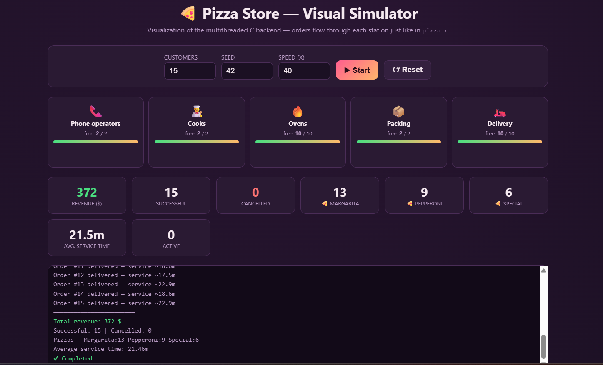

# 🍕 Pizza Store — Multithreaded Simulation

A multithreaded simulation of a pizza store, written in **C** using the **POSIX Threads (pthreads)** library.
The program models the full lifecycle of customer orders — from the phone call, through cooking, baking,
packing and delivery — while many orders are processed **concurrently** and shared resources are protected
with **mutexes** and **condition variables**.

A lightweight, **frontend-only** web visualizer (`index.html`) is also included so you can *see* the
simulation flow in your browser without modifying the C backend.



---

## 📚 Academic Context

This project was developed as an **assignment for the "Operating Systems" course**, taught in the
**5th semester** of the undergraduate program at the **Athens University of Economics and Business (AUEB)**
— *Οικονομικό Πανεπιστήμιο Αθηνών (ΟΠΑ)*, Department of Informatics.

The goal of the assignment is to practice the core concepts of operating systems:
- **Threads** and concurrent execution
- **Synchronization** with mutexes (mutual exclusion)
- **Condition variables** for signaling between threads
- Avoiding **race conditions** on shared data
- Measuring performance metrics (service time, cooling time, throughput)

---

## 🧩 How the simulation works

Each **customer** is represented by its own thread (`customer_routine`). Every order passes sequentially
through the following **stations**, each with a limited number of available employees/resources:

| Station          | Resource              | Default count | Constant in `pizza.h`             |
|------------------|-----------------------|:-------------:|-----------------------------------|
| 📞 Phone operators | takes the order       | 2             | `number_of_telephone_operators`   |
| 👨‍🍳 Cooks          | prepares the pizzas   | 2             | `number_of_cooks`                 |
| 🔥 Ovens          | bakes the pizzas      | 10            | `number_of_ovens`                 |
| 📦 Packers        | packs the order       | 2             | `number_of_packers`               |
| 🛵 Deliverers     | delivers & returns    | 10            | `number_of_deliverers`            |

When a resource is busy, the customer thread **waits** on a condition variable (`pthread_cond_wait`)
until a resource is freed and the corresponding thread sends a signal (`pthread_cond_signal`).
Every access to a shared/global variable is wrapped in a `pthread_mutex_lock` / `pthread_mutex_unlock`
pair so that two threads can never modify it at the same time.

### Order flow

```
Customer call ─▶ Phone operator ─▶ Payment check ─▶ Cook ─▶ Oven ─▶ Packer ─▶ Deliverer ─▶ Done
                       │                  │
                       │                  └─ 5% chance the card is declined → order cancelled
                       └─ assigns pizzas: Margarita / Pepperoni / Special
```

### Business rules (all configurable in `pizza.h`)

- Each order contains a random number of pizzas (`1`–`number_orderhigh`).
- Pizza mix probabilities: **Margarita 45%**, **Pepperoni 35%**, **Special 20%**.
- Prices: **Margarita 12$**, **Pepperoni 14$**, **Special 15$**.
- **5%** probability that a payment fails → the order is cancelled.
- Timing constants for preparation, baking, packing and delivery (in simulated "minutes").

### Statistics printed at the end

- Total revenue
- Number of pizzas sold of each kind
- Number of successful / unsuccessful (cancelled) orders
- **Average** and **maximum service time** (from the call until delivery)
- **Average** and **maximum cooling time** (from leaving the oven until delivery)

---

## 📁 Project structure

| File           | Description                                                        |
|----------------|--------------------------------------------------------------------|
| `pizza.c`      | The main program — threads, mutexes, condition variables, logic.   |
| `pizza.h`      | All configuration constants (employees, prices, probabilities…).   |
| `test-res.sh`  | Small helper script for running tests.                             |
| `index.html`   | Frontend-only web visualizer (no build, just open in a browser).   |
| `screenshot.png` | Screenshot of the web visualizer.                                |

---

## ⚙️ Building & running the C backend

### Requirements
- A C compiler (`gcc`) with **pthread** support
- `make` is not required — a single `gcc` command is enough

> **Linux / macOS:** pthreads are built in.
> **Windows:** use **WSL**, **MSYS2/MinGW**, or **Cygwin** (the code already provides a
> Windows-compatible `rand_r` implementation via `#ifdef _WIN32`).

### Compile

```bash
gcc pizza.c -o pizza -lpthread -lm
```

### Run

The program takes **two command-line arguments**:

```bash
./pizza <number_of_customers> <seed>
```

- `number_of_customers` — how many customer threads (orders) to simulate
- `seed` — seed for the random number generator (use the same seed to reproduce a run)

**Example:**

```bash
./pizza 15 42
```

**Sample output:**

```
Order with id 1 was added
Order with id 3 got cancelled
The preparation time of the order with id 1 is 12 minutes
The service time of the order with id 1 is 21 minutes
...
The overal revenue is 372 $
13 margarita pizzas were sold
9 pepperone pizzas were sold
6 special pizzas were sold
There were 15 successful orders
There were 0 unsuccessful orders
The average service time is 21.46 minutes
The maximum service time is 25 minutes
The average cooling time is 3.20 minutes
The maximun cooling time is 6 minutes
```

> 💡 The simulation uses `sleep()` to represent time, so a run takes a real amount of seconds.
> Increase the seed/customers to experiment with different scenarios.

---

## 🌐 Running the web visualizer (frontend)

The visualizer is a **single self-contained HTML file** — no installation, no build step, no backend.
It re-implements the *same* parameters from `pizza.h` and the *same* random logic in JavaScript, purely
to **illustrate** how orders flow through the stations.

**Easiest way:** just **double-click `index.html`** to open it in your browser.

Or serve it locally:

```bash
# with Python
python -m http.server 8000
# then open http://localhost:8000/index.html
```

### Using it
1. Set the number of **Customers**, the **Seed**, and the **Speed** multiplier.
2. Press **▶ Start**.
3. Watch the orders (🍕) flow through *Phone operators → Cooks → Ovens → Packing → Delivery*, while the
   live stats (revenue, pizza counts, average service time, cancellations) update in real time.

> ⚠️ The web visualizer is **for visualization only** — the authoritative implementation is the
> C backend (`pizza.c`). The frontend does **not** modify or replace it.

---

## 👤 Author

**Christos Lavidas** — Athens University of Economics and Business (AUEB)
